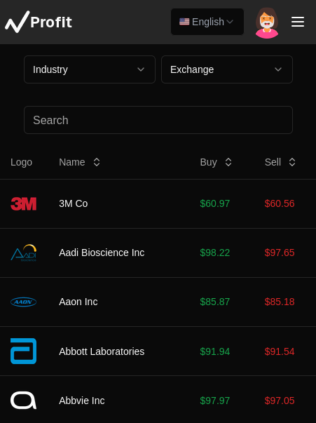

<a id="readme-top"></a>
[![Contributors][contributors-shield]][contributors-url]
[![Stargazers][stars-shield]][stars-url]
[![Issues][issues-shield]][issues-url]
[![Unlicense License][license-shield]][license-url]

<!-- PROJECT LOGO -->
<br />
<div align="center">
  <a href="https://github.com/projekt-zespolowy-ug/P.Y.T.A">
    
  </a>

  <h3 align="center">Profit - Your Trading App</h3>

  <p align="center">
    Introducing P.Y.T.A., a simple and user-friendly platform that allows you to buy and sell stocks with ease. With real-time market updates and straightforward portfolio tracking, Profit provides a seamless experience for traders at any level. Designed for simplicity and clarity, it helps you manage your investments efficiently and confidently.
    <br />
    <a href="https://pyta.app">View Demo</a>
    &middot;
    <a href="https://github.com/projekt-zespolowy-ug/P.Y.T.A/issues/new?labels=bug&template=bug-report---.md">Report Bug</a>
    &middot;
    <a href="https://github.com/projekt-zespolowy-ug/P.Y.T.A/issues/new?labels=enhancement&template=feature-request---.md">Request Feature</a>
  </p>
</div>

<!-- TABLE OF CONTENTS -->
<details>
  <summary>Table of Contents</summary>
  <ol>
    <li>
      <a href="#about-the-project">About The Project</a>
      <ul>
        <li><a href="#built-with">Built With</a></li>
      </ul>
    </li>
    <li>
      <a href="#getting-started">Getting Started</a>
      <ul>
        <li><a href="#prerequisites">Prerequisites</a></li>
        <li><a href="#installation">Installation</a></li>
      </ul>
    </li>
    <li><a href="#usage">Usage</a></li>
    <li><a href="#top-contributors">Top Contributors</a></li>
    <li><a href="#license">License</a></li>
    <li><a href="#contact">Contact</a></li>
  </ol>
</details>

## About The Project

<div align="center">
  <a href="https://github.com/projekt-zespolowy-ug/P.Y.T.A">
    
  </a>
</div>

<p align="right">(<a href="#readme-top">back to top</a>)</p>

### Built With

This section should list any major frameworks/libraries used to bootstrap your project. Leave any add-ons/plugins for the acknowledgements section. Here are a few examples.

- [![Bun][Bun]][blank]
- [![FastApi][FastApi]][blank]
- [![Next][Next.js]][blank]
- [![Postgres][Postgres]][blank]
- [![Pytest][Pytest]][blank]
- [![Python][Python]][blank]
- [![Radix UI][Radix UI]][blank]
- [![React][React.js]][blank]
- [![Shadcn][Shadcn]][blank]
- [![TailwindCSS][TailwindCSS]][blank]
- [![TypeScript][TypeScript]][blank]
<p align="right">(<a href="#readme-top">back to top</a>)</p>

<!-- GETTING STARTED -->

## Getting Started

This is an example of how you may give instructions on setting up your project locally.
To get a local copy up and running follow these simple example steps.

### Prerequisites

- Arch lamix operating system or the superior lamix system <a href="https://uwuntuos.site/">Uwuntu</a>
- Docker engine (please follow instructions from <a href="https://docs.docker.com/engine/install/">here</a>)

This is an example of how to list things you need to use the software and how to install them.


### Installation

1. Clone the repo
   ```sh
   git clone https://github.com/projekt-zespolowy-ug/P.Y.T.A.git
   ```
2. Use our awesome convenience script
   ```sh
   chmod u+x ./run.sh
   ./run.sh
   echo "PYTA"
   ```

<p align="right">(<a href="#readme-top">back to top</a>)</p>

## Usage
1. Open your web browser
2. Type `http://localhost:3000` into search field

OR

1. Simply open <a href="https://pyta.app">demo hosted by us </a>
<p align="right">(<a href="#readme-top">back to top</a>)</p>

## Top contributors:

<a href="https://github.com/projekt-zespolowy-ug/P.Y.T.A/contributors">
  
</a>

<p align="right">(<a href="#readme-top">back to top</a>)</p>

<!-- LICENSE -->

## License

Distributed under the Pyta-license License. See `LICENSE` for more information.

<p align="right">(<a href="#readme-top">back to top</a>)</p>

<!-- CONTACT -->

## Contact

Project Link: [https://github.com/projekt-zespolowy-ug/P.Y.T.A](https://github.com/projekt-zespolowy-ug/P.Y.T.A)

<p align="right">(<a href="#readme-top">back to top</a>)</p>

[contributors-shield]: https://img.shields.io/github/contributors/projekt-zespolowy-ug/P.Y.T.A.svg?style=for-the-badge
[contributors-url]: https://github.com/othneildrew/projekt-zespolowy-ug/P.Y.T.A//contributors
[forks-shield]: https://img.shields.io/github/forks/projekt-zespolowy-ug/P.Y.T.A.svg?style=for-the-badge
[stars-shield]: https://img.shields.io/github/stars/projekt-zespolowy-ug/P.Y.T.A.svg?style=for-the-badge
[stars-url]: https://github.com/projekt-zespolowy-ug/P.Y.T.A/stargazers
[issues-shield]: https://img.shields.io/github/issues/projekt-zespolowy-ug/P.Y.T.A.svg?style=for-the-badge
[issues-url]: https://github.com/projekt-zespolowy-ug/P.Y.T.A/issues
[license-shield]: https://img.shields.io/github/license/projekt-zespolowy-ug/P.Y.T.A.svg?style=for-the-badge
[license-url]: https://github.com/projekt-zespolowy-ug/P.Y.T.A/blob/master/LICENSE
[product-screenshot]: images/screenshot.png
[Next.js]: https://img.shields.io/badge/next.js-000000?style=for-the-badge&logo=nextdotjs&logoColor=white
[React.js]: https://img.shields.io/badge/React-20232A?style=for-the-badge&logo=react&logoColor=61DAFB
[Python]: https://img.shields.io/badge/python-3670A0?style=for-the-badge&logo=python&logoColor=ffdd54
[Python-url]: https://www.python.org/
[Shadcn]: https://img.shields.io/badge/shadcn/ui-000000?style=for-the-badge&logo=shadcn/ui&logoColor=white
[Shadcn-url]: https://ui.shadcn.com/
[ChatGPT]: https://img.shields.io/badge/chatGPT-74aa9c?style=for-the-badge&logo=openai&logoColor=white
[GitHub Copilot]: https://img.shields.io/badge/github_copilot-8957E5?style=for-the-badge&logo=github-copilot&logoColor=white
[Brave]: https://img.shields.io/badge/Brave-FB542B?style=for-the-badge&logo=Brave&logoColor=white
[Google Drive]: https://img.shields.io/badge/Google%20Drive-4285F4?style=for-the-badge&logo=googledrive&logoColor=white
[Postgres]: https://img.shields.io/badge/postgres-%23316192.svg?style=for-the-badge&logo=postgresql&logoColor=white
[Inkscape]: https://img.shields.io/badge/Inkscape-e0e0e0?style=for-the-badge&logo=inkscape&logoColor=080A13
[Bun]: https://img.shields.io/badge/Bun-%23000000.svg?style=for-the-badge&logo=bun&logoColor=white
[FastAPI]: https://img.shields.io/badge/FastAPI-005571?style=for-the-badge&logo=fastapi
[NodeJS]: https://img.shields.io/badge/node.js-6DA55F?style=for-the-badge&logo=node.js&logoColor=white
[Pytest]: https://img.shields.io/badge/pytest-%23ffffff.svg?style=for-the-badge&logo=pytest&logoColor=2f9fe3
[Radix UI]: https://img.shields.io/badge/radix%20ui-161618.svg?style=for-the-badge&logo=radix-ui&logoColor=white
[React Query]: https://img.shields.io/badge/-React%20Query-FF4154?style=for-the-badge&logo=react%20query&logoColor=white
[React Hook Form]: https://img.shields.io/badge/React%20Hook%20Form-%23EC5990.svg?style=for-the-badge&logo=reacthookform&logoColor=white
[Gunicorn]: https://img.shields.io/badge/gunicorn-%298729.svg?style=for-the-badge&logo=gunicorn&logoColor=white
[Visual Studio Code]: https://img.shields.io/badge/Visual%20Studio%20Code-0078d7.svg?style=for-the-badge&logo=visual-studio-code&logoColor=white
[HTML5]: https://img.shields.io/badge/html5-%23E34F26.svg?style=for-the-badge&logo=html5&logoColor=white
[Markdown]: https://img.shields.io/badge/markdown-%23000000.svg?style=for-the-badge&logo=markdown&logoColor=white
[JavaScript]: https://img.shields.io/badge/javascript-%23323330.svg?style=for-the-badge&logo=javascript&logoColor=%23F7DF1E
[Bash Script]: https://img.shields.io/badge/bash_script-%23121011.svg?style=for-the-badge&logo=gnu-bash&logoColor=white
[TypeScript]: https://img.shields.io/badge/typescript-%23007ACC.svg?style=for-the-badge&logo=typescript&logoColor=white
[blank]: #
[TailwindCSS]: https://img.shields.io/badge/tailwindcss-%2338B2AC.svg?style=for-the-badge&logo=tailwind-css&logoColor=white
